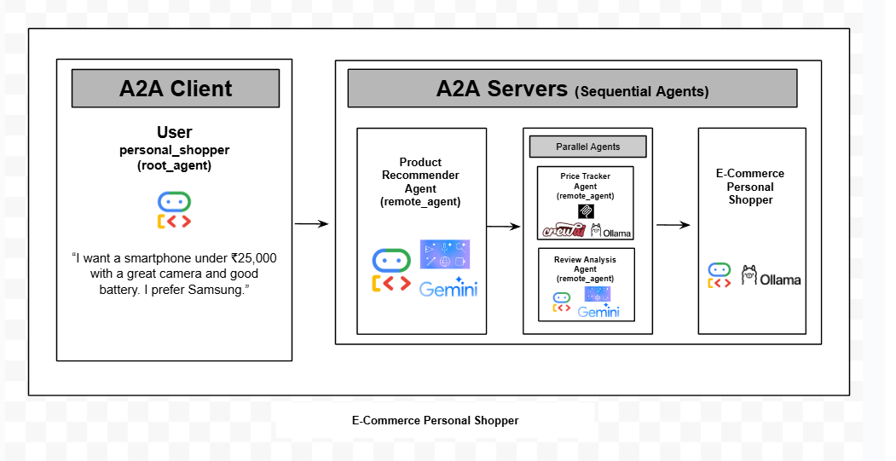
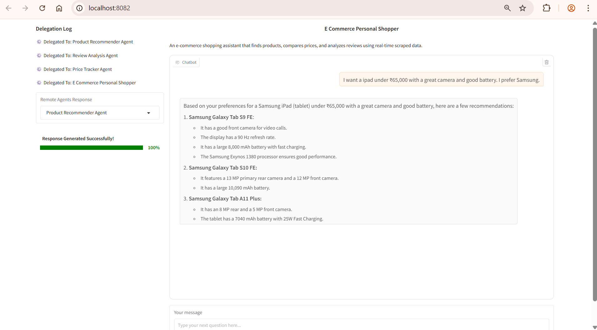
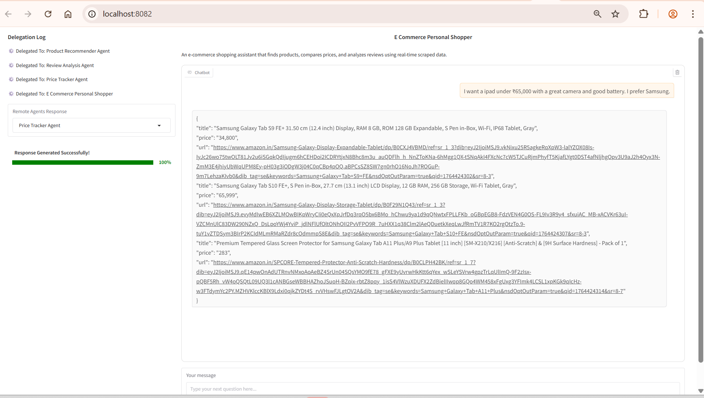
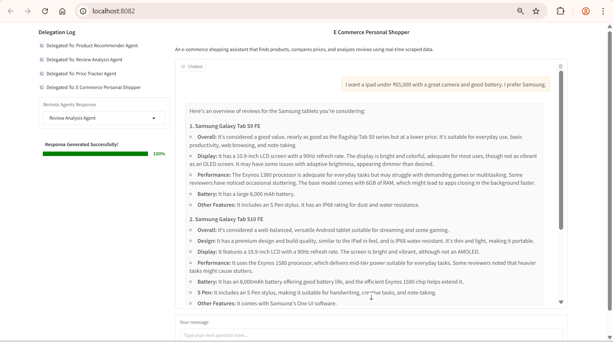
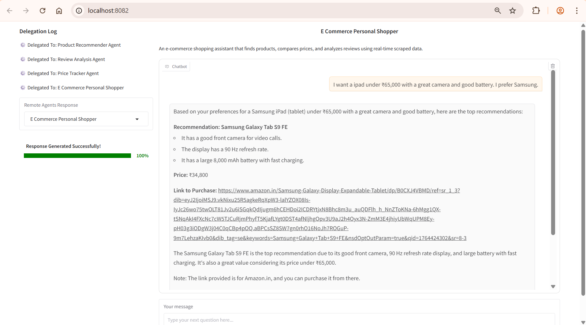

## E-Commerce Personal Shopper
Given an e-commerce shopping related query, the `E-Commerce Personal Shopper` assistant finds products, compares prices, and analyzes reviews using real-time scraped data. And then provides personalized suggestion.  


### For example:  
If the user asks,
"I want an ipad under ₹65,000 with a great camera and good battery. I prefer Samsung."

Then,   
**Remote_Agent_1 [Product Recommender Agent]:** Recommends products for the user query


**Remote_Agent_2 [Price Tracker Agent]:** Scrapes Amazon website [MCP tool] and fetches the purchase links and prices for the products.


**Remote_Agent_3 [Review Analysis Agent]:** Uses google_search and analyzes the reviews for the products suggested by the 'Product Recommender Agent'.


**E-Commerce Personal Shopper:** Finally, provides personalized suggestion based on the remote_agents analysis.


The `E-Commerce Personal Shopper` acts as a root agent [GoogleADK]. It has three remote agents.

1. **Product Recommender Agent [GoogleADK Agent]** -> For the user query based on e-commerce, suggests products to purchase. It uses `google_search`.
2. **Price Tracker Agent [CrewAI]** -> Uses MCP tool and fetches live prices for products suggested by the `Product Recommender Agent`. It scrapes the Amazon website.
3. **Review Analysis Agent [Google ADK]** -> Analyzes reviews for the products suggested by the `Product Recommender Agent`. It uses `google_search`

The `Personal_Shopper` (the root agent) uses [SequentialAgent workflow](https://google.github.io/adk-docs/agents/workflow-agents/sequential-agents/). It first runs the `Product Recommender Agent`. Then using [ParallelAgent workflow](https://google.github.io/adk-docs/agents/workflow-agents/parallel-agents/), `Price Tracker Agent` and 
`Review Analysis Agent` gets executed in parallel. It takes the input of `Product Recommender Agent`. Finally `E Commerce Personal Shopper` provides personalized suggestion for the purchase of the product.

## Agents Involved

| Agents                         | Framework  | Status       |
| ------------------------------ | ---------- | ------------ |
| Product Recommender Agent                | Crewai     | ✅ Completed |
| Price Tracker Agent                 | Google ADK | ✅ Completed |
| Review Analysis Agent          | Google ADK | ✅ Completed |
| E Commerce Personal Shopper (Root Agent) | Google ADK | ✅ Completed |

## What Makes This Project Unique?

1. Connected the **root agent** with multiple **remote agents** using `RemoteA2aAgent()`.
2. Implemented a workflow using both SequentialAgent and ParallelAgent architectures.
3. Demonstrated how to use Gemini models.
4. Demonstrated how to use Ollama models.
5. Demonstrated how to use MCP tools.
6. Showcased the use of defaults tools (google_search).
7. Integrated different frameworks, including Crewai and Google ADK.
8. Demonstrated how to connect the root_agent with the remote_agents for collaborative task execution.

## Setup

```bash
conda create -n capstone_demo python=3.12 -y
conda activate capstone_demo

git clone git@github.com:Jereshea/AgenticAI_CapstoneProject.git
cd AgenticAI_CapstoneProject/requirements/
pip install -r requirements.txt
pip install litellm==1.77.4
curl -fsSL https://ollama.com/install.sh | OLLAMA_VERSION=0.12.1 sh
```

## Models and Deployments

**In this example, we use the following models:**  

1. gemini-2.0-flash (Requires GOOGLE_API_KEY)
2. a custom Ollama model (llama3.1:8b -> llama3.1-cpu-custom)

### Gemini Model:
Generate an [API key](https://aistudio.google.com/app/api-keys)
```bash
export GOOGLE_API_KEY= {Your_API_Key}
```
### Ollama model:

***CPU:***  
This demo was originally tested on a CPU-enabled system. If you want to run it on **CPU**, use the steps below. In many cases, **Ollama models actually perform better on a single-socket CPU setup**, so CPU execution can be more efficient depending on your hardware.

```bash
ollama pull llama3.1:8b
ollama show --modelfile llama3.1:8b > Modelfile_cpu_llama3_1
```

Add the line 'num_gpu=0' and 'PARAMETER num_thread 128
' in the file 'Modelfile_cpu_llama3_1'

```bash
PARAMETER stop <|start_header_id|>
PARAMETER stop <|end_header_id|>
PARAMETER stop <|eot_id|>
PARAMETER num_gpu 0
PARAMETER num_thread 128
```

Now create a custom model

```bash
sudo ollama create llama3.1-cpu-custom -f Modelfile_cpu_llama3_1
```

***GPU [Optional]:***  
```bash
ollama pull llama3.1:8b  
ollama show --modelfile llama3.1:8b > Modelfile_cpu_llama3_1
sudo ollama create llama3.1-cpu-custom -f Modelfile_cpu_llama3_1
```

**Note:** Ollama performs better in single sockect, hence added the line to control threads in the modelfile.

## To Run

### Terminal 1

```bash
conda activate capstone_demo

cd AgenticAI_CapstoneProject/remote_agents/price_tracker

python __main__.py
```
### Terminal 2

```bash
conda activate capstone_demo

cd AgenticAI_CapstoneProject/remote_agents/product_recommender

export GOOGLE_API_KEY= {Your_API_Key}

python __main__.py
```
### Terminal 3

```bash
conda activate capstone_demo

cd AgenticAI_CapstoneProject/remote_agents/review_analysis

export GOOGLE_API_KEY= {Your_API_Key}

python __main__.py
```
### Terminal 4

```bash
conda activate capstone_demo

cd AgenticAI_CapstoneProject

python gradio_script.py
```